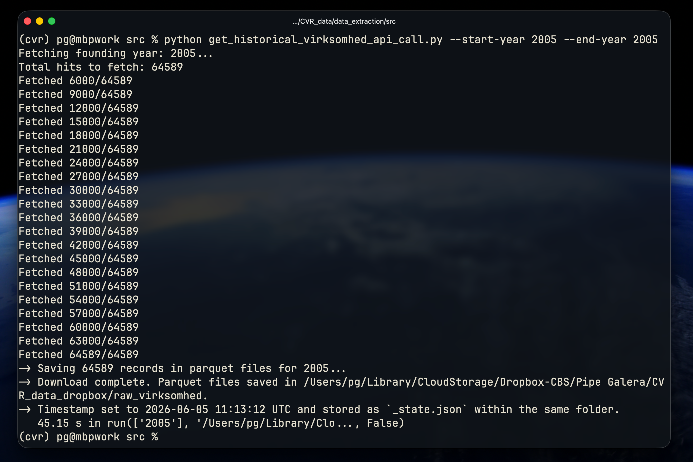

# Danish Central Business Register Data - English Documentation and Scripts

## What ?

Python scripts to mass download Centralt Virksomhedsregister (CVR) data using the official API. Examples provided at [`examples/`](examples/)

For the official API documentation please go to: [https://datacvr.virk.dk/artikel/om-cvr](https://datacvr.virk.dk/artikel/om-cvr)

## Why?

This is free and open-source. Many companies take advantage of the poor API documentation to build their own data pipelines and charge clients for theis free data.

The Official CVR API:

- Is in Danish, making it not very accesible for international researchers.
- Lacks of basic features (e.g. description of the schema and fields).
- Is barebones (e.g. no hands-on examples, see [here](https://erhvervsstyrelsen.dk/kom-godt-igang-med-elasticSearch)).
- Does not focus on mass downloads for research purposes (e.g. _get all active companies in Denmark, all fields_)

## Do you have access to Statistics Denmark ?

Use Statistics Denmark (_DST_) instead if you have access to it.

Please notice that the data validation of Danish companies' digital annual accounts is not very thorough. Companies must legally submit their info in XBRL format (eXtensible Business Reporting Language) every year. This information is extractred using the scripts in this repository - but there is not a "danish workforce" in charge of making sure the information is correct (see [https://www.version2.dk/artikel/fejl-i-regnskabsdata-tvinger-virksomheder-og-myndigheder-til-manuel-kontrol](https://www.version2.dk/artikel/fejl-i-regnskabsdata-tvinger-virksomheder-og-myndigheder-til-manuel-kontrol))

## Data Extraction

For detailed information about data extraction scripts and structure, see [Data Extraction Documentation](data_extraction/README.md).

Sources:

    1. Company Data (`virksomhed`)
    2. Financial Statements (`offentliggoerelser`)
    3. Expanded Financial Statements

Expanded Financial Statements cannot be extracted anymore (See: [https://erhvervsstyrelsen.dk/vejledning-adgang-til-oplysninger-om-reelle-ejere](https://erhvervsstyrelsen.dk/vejledning-adgang-til-oplysninger-om-reelle-ejere)). The script `individual_statements_api_call.py` under `data_extraction` is left for documentation purposes.

## Limitations and TODOs

These are pending features/improvements that I did not have the time to document or create scripts.

### Missing data: Production Units

Production units (`produktionsenhed`) are available via direct API queries to the `http://distribution.virk.dk/cvr-permanent/produktionsenhed/_search` endpoint.

### Missing data: Participant Units

Individuals and entities participating in companies (`offentliggoerelser`) are available via direct API queries to the `http://distribution.virk.dk/offentliggoerelser/_search` endpoint.

These fields can be implemented to the original script.

## Helpful Resources

Below are other project and resources found in the open internet that helps to understand the data.

- https://github.com/Brokk-Sindre/cvr-documentation
- https://brokk-sindre.github.io/cvr-documentation/api-reference/overview
- https://github.com/Klimabevaegelsen/landbruget.dk/blob/240e6f7a2002b8facec2d2d7df3312b1c6254cbe/docs/analysis/cvr_pnumber_address_discovery.md
- https://research-api.cbs.dk/ws/portalfiles/portal/62184301/898370_Predicting_Financial_Distress.pdf
